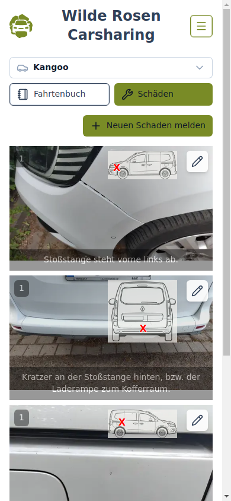
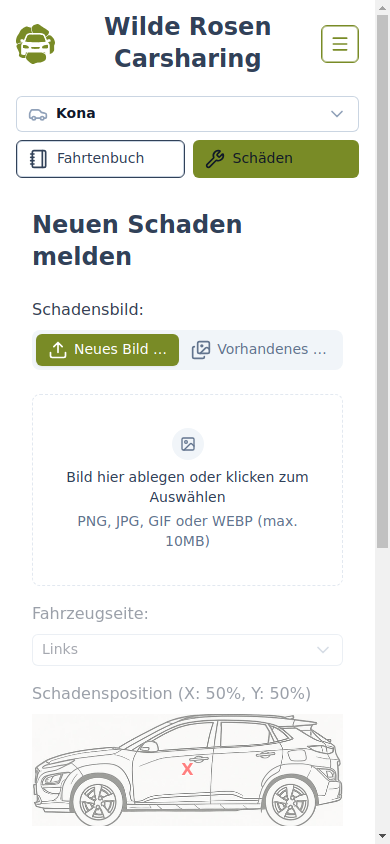

# Guide for Damage Reporters — Reporting and Editing Damages

Damage reporters can add new damages and edit existing ones. You need an account with the **damageReporter** role.

## 1. Log In

Click the login icon in the top-right corner and sign in with your account.

## 2. Navigate to Damages

Select a car from the home page. The damages view opens by default.

As a damage reporter, you will see:

- A **Neuen Schaden melden** (Report New Damage) button at the top
- An edit icon on each existing damage entry

## 3. Report a New Damage

Click **Neuen Schaden melden** to open the damage report form.

Fill in the form:

1. **Schadensbild** — Upload a photo of the damage (drag and drop or click to browse). You can also choose an existing image from Firebase Storage.
2. **Fahrzeugseite** — Select which side of the car is damaged (Links/Rechts/Vorne/Hinten/Oben).
3. **Schadensposition** — Click on the car schematic to mark the exact location of the damage.
4. **Schadensbeschreibung** — Describe the damage in the text field.
5. **Schadensdetails** — Optionally add more detail photos with descriptions.
6. Click **Schaden melden** to submit.

## 4. Edit an Existing Damage

Click the pencil icon on any damage entry to open it for editing. The form is pre-filled with the existing data. Make your changes and click **Schaden aktualisieren** to save.
