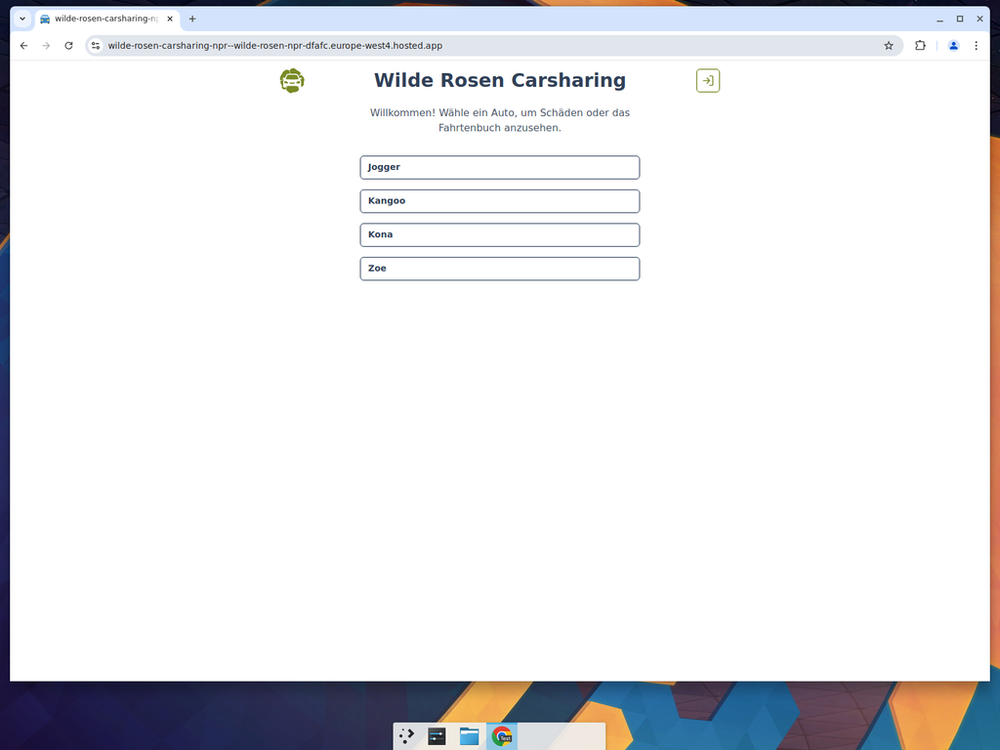
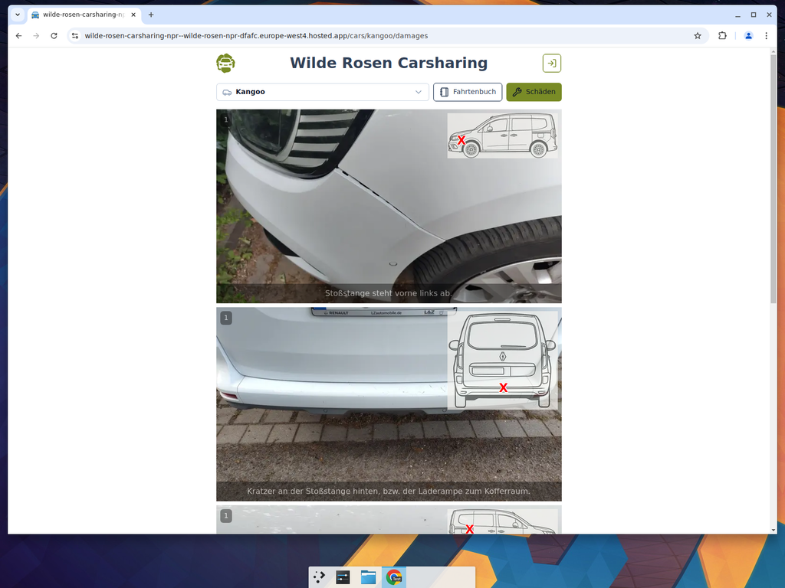
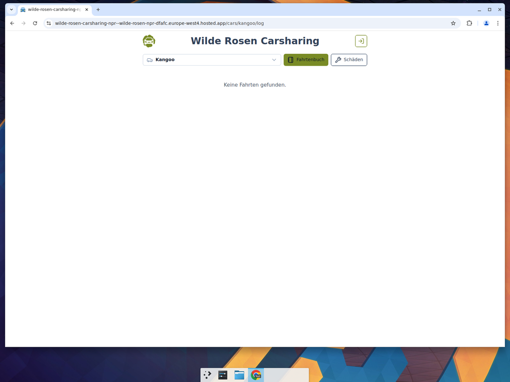

# Guide for Guests — Viewing Car Damages

No account is required to view car damages.

## 1. Open the App

Navigate to the Wilde Rosen Carsharing website. You will see the home page with a list of available cars.

## 2. Select a Car

Click on a car name (e.g. **Kangoo**) to view its damages.

## 3. View Damages

The damages page shows all reported damages for the selected car. Each entry includes:

- A photo of the damage
- A schematic showing the location on the vehicle (marked with an **X**)
- A description of the damage

Click on a damage image to open a lightbox with detail photos.

## 4. Switch Cars

Use the dropdown at the top of the page to switch between cars.

## 5. View the Fahrtenbuch (Tour Log)

Click the **Fahrtenbuch** button to see recorded tours. Without logging in, no tours are displayed.

