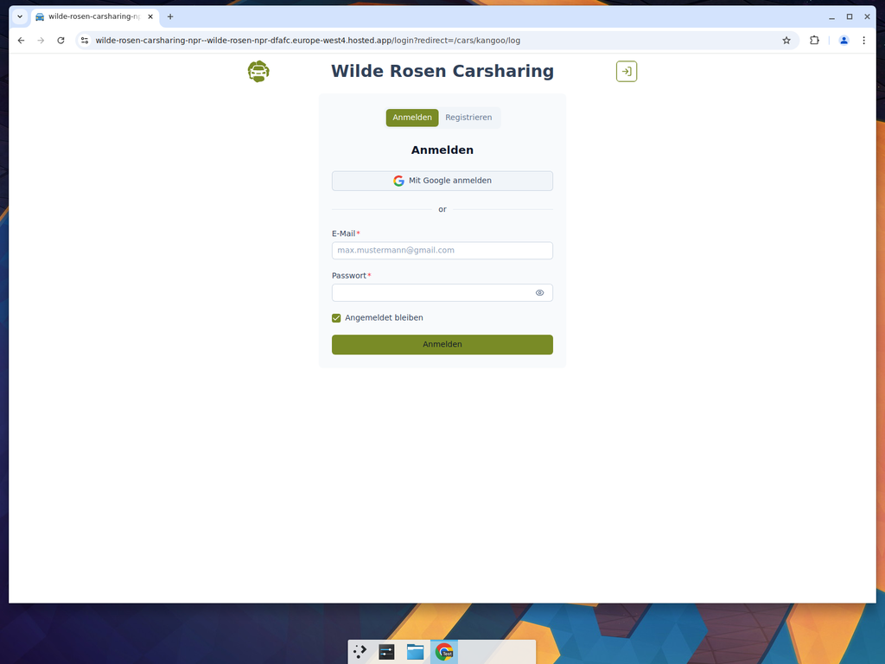
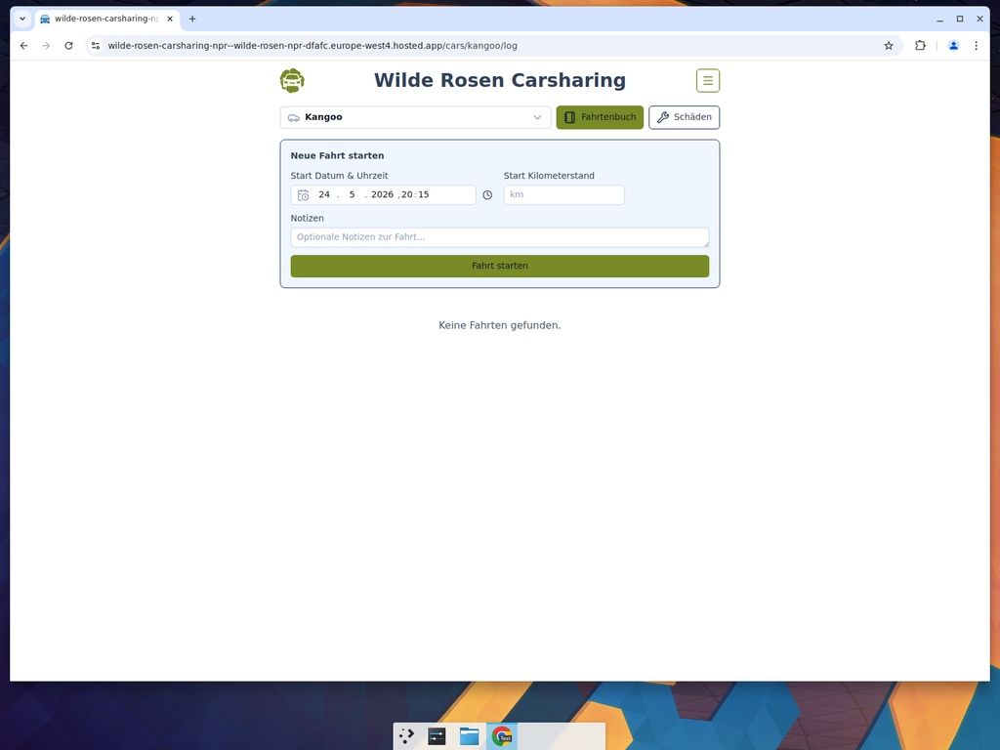
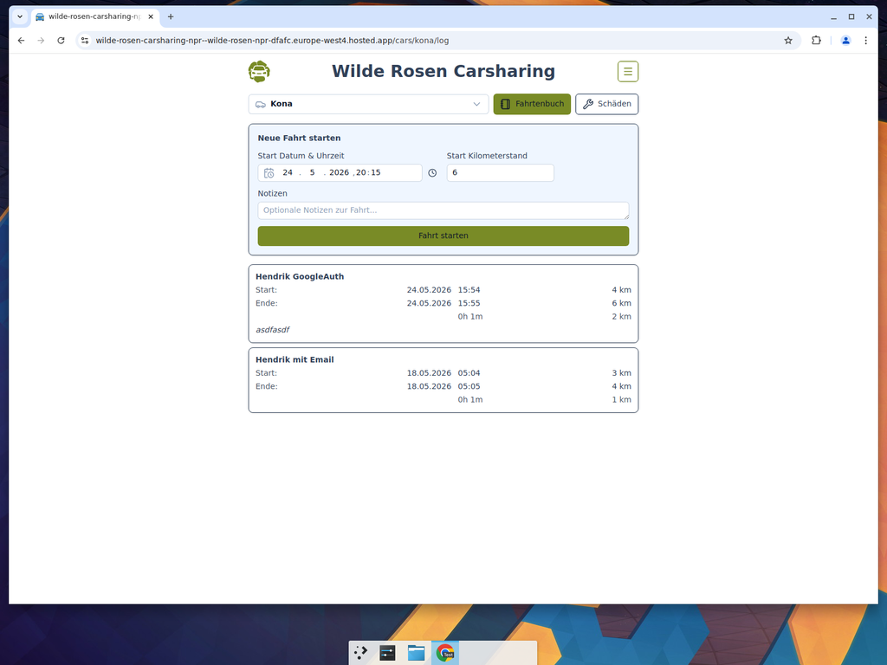

# Guide for Members — Logging Tours (Fahrtenbuch)

Members can log car tours in the Fahrtenbuch. You need an account with the **member** role.

## 1. Log In

Click the login icon in the top-right corner to open the login page. Sign in with your email and password, or use Google Sign-In.

## 2. Select a Car

From the home page, click on a car to open it. Then click the **Fahrtenbuch** button in the navigation bar.

## 3. Start a New Tour

The Fahrtenbuch page shows a **Neue Fahrt starten** (Start New Tour) form at the top:

1. **Start Datum & Uhrzeit** — The current date and time are pre-filled. Adjust if needed.
2. **Start Kilometerstand** — Enter the odometer reading at the start of your trip (pre-filled with the last known value).
3. **Notizen** — Add optional notes about the trip.
4. Click **Fahrt starten** to start the tour.

## 4. End a Tour

When you have an open (unfinished) tour, the form switches to an **end tour** mode. Fill in:

1. **Ende Datum & Uhrzeit** — The date and time you finished driving.
2. **End Kilometerstand** — The odometer reading at the end of your trip.
3. Click **Fahrt beenden** to complete the tour.

## 5. View Past Tours

Below the form, all recorded tours for the selected car are listed with start/end times, kilometers driven, and any notes.

